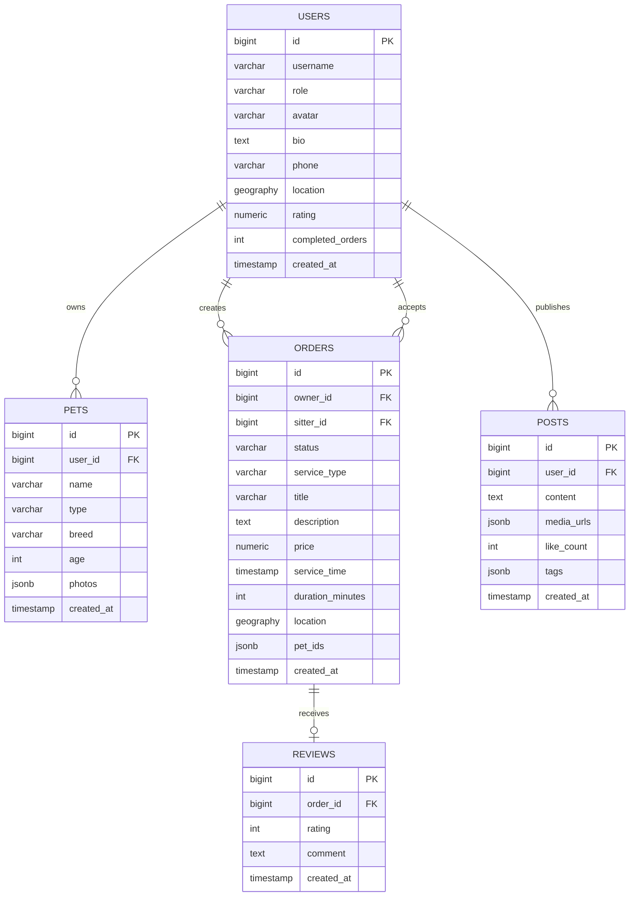
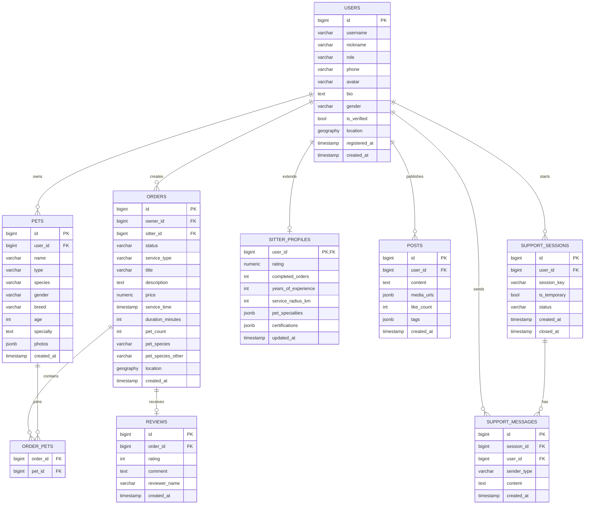

# 数据库 ER 结构说明文档

## 1. 文档目标

本文档用于说明宠友邻项目当前数据库层的实体关系结构，分为两部分：

- 当前已经在 SQL 中正式定义的数据库结构
- 结合前后端现有功能、接口和数据模型，推导出的目标 ER 结构

这份文档的重点不是“理想化设计”，而是基于当前仓库真实代码来说明：

- 现在已经有哪些表、字段、外键和视图
- 当前实体之间是什么关系
- 哪些业务已经在代码里存在，但数据库还没有正式落表
- 后续如果从 Mock Store 切换到真实数据库，应该优先补哪些实体关系

## 2. 信息来源

本文档整理依据如下：

- 数据库初始化脚本：`backend/sql/init_postgis.sql`
- 后端内存数据存储：`backend/app/services/store.py`
- 后端演示数据：`backend/app/data/mock_data.py`
- 后端数据模型：`backend/app/schemas/users.py`
- 后端数据模型：`backend/app/schemas/orders.py`
- 后端数据模型：`backend/app/schemas/posts.py`
- 后端数据模型：`backend/app/schemas/support.py`
- 容器配置：`docker-compose.yml`

## 3. 当前数据库部署现状

项目已经提供了数据库基础设施，但业务代码默认仍运行在 Mock 模式。

当前基础设施包括：

- PostgreSQL 16 + PostGIS
- Redis 7
- 初始化 SQL 自动挂载到 PostgreSQL 容器中执行

说明：

- PostgreSQL / PostGIS 已具备空间位置建模能力
- Redis 容器已配置，但当前业务代码没有正式接入
- 后端默认并未把订单、帖子、客服消息等数据写入 PostgreSQL，而是写在内存中的 `MockStore`

## 4. 当前已落地数据库实体

根据 `backend/sql/init_postgis.sql`，当前已经正式定义的实体如下：

- `users`
- `pets`
- `orders`
- `posts`
- `reviews`
- 视图 `nearby_pending_orders`

## 5. 当前 SQL 版 ER 总览

## 6. 当前实体逐表说明

### 6.1 users

用途：存储平台用户。

主键：

- `id`

关键字段：

- `username`：用户名，唯一
- `role`：角色，当前限制为 `owner` 或 `sitter`
- `avatar`：头像地址
- `bio`：简介
- `phone`：手机号，唯一
- `location`：PostGIS 地理点位
- `rating`：评分
- `completed_orders`：完成订单数
- `created_at`：创建时间

关系：

- 1 个用户可以拥有多只宠物
- 1 个用户可以发布多条订单
- 1 个用户作为护理达人可以接多个订单
- 1 个用户可以发布多篇社区帖子

说明：

- 当前 SQL 中 `users` 更像基础用户表
- 但代码里的用户模型实际上还包含 `nickname`、`gender`、`registered_at`、`is_verified`、`tags` 等字段
- 这说明真实持久化时，`users` 表还需要扩展，或者拆为 `users + sitter_profiles`

### 6.2 pets

用途：存储用户名下宠物档案。

主键：

- `id`

外键：

- `user_id -> users.id`

关键字段：

- `name`：宠物名称
- `type`：宠物类型，限制为 `cat`、`dog`、`other`
- `breed`：品种
- `age`：年龄
- `photos`：照片列表，JSONB
- `created_at`：创建时间

关系：

- 多只宠物属于一个用户

说明：

- 当前代码中的宠物模型还存在 `species`、`gender`、`specialty` 字段
- 这些字段目前不在 SQL 中，意味着宠物档案表还没有和前端展示完全对齐

### 6.3 orders

用途：存储宠物服务订单。

主键：

- `id`

外键：

- `owner_id -> users.id`
- `sitter_id -> users.id`

关键字段：

- `status`：订单状态，当前限制为 `pending`、`taken`、`done`、`cancelled`
- `service_type`：服务类型
- `title`：标题
- `description`：描述
- `price`：价格
- `service_time`：服务时间
- `duration_minutes`：服务时长
- `location`：订单位置，PostGIS 地理点位
- `pet_ids`：订单关联宠物 ID 列表，JSONB
- `created_at`：创建时间

关系：

- 一个用户可以发布多个订单
- 一个护理达人可以接多个订单
- 一个订单理论上关联一个或多个宠物
- 一个订单可产生一条评价

说明：

- 当前 SQL 使用 `pet_ids JSONB` 保存订单与宠物的关系，这是一种弱关系建模
- 如果进入正式生产，建议增加中间表 `order_pets`，替代 JSONB 方式
- 当前代码中的订单模型还包含 `pet_count`、`pet_species`、`pet_species_other`、`distance_km`、`review` 等扩展信息
- 其中 `distance_km` 是查询结果字段，不建议落库
- `review` 更适合通过关联表查询而不是嵌入订单表

### 6.4 posts

用途：存储社区动态 / 帖子。

主键：

- `id`

外键：

- `user_id -> users.id`

关键字段：

- `content`：帖子正文
- `media_urls`：媒体资源列表，JSONB
- `like_count`：点赞数
- `tags`：标签列表，JSONB
- `created_at`：创建时间

关系：

- 一个用户可以发布多条帖子

说明：

- 当前 SQL 中 `posts` 是轻量设计
- 当前代码会在接口层拼出 `author` 对象，这部分来自 `users` 表联查，而不是 `posts` 自身字段

### 6.5 reviews

用途：存储订单评价。

主键：

- `id`

外键：

- `order_id -> orders.id`

关键字段：

- `rating`：评分，1 到 5
- `comment`：评价内容
- `created_at`：创建时间

关系：

- 一个订单对应零或一条评价

说明：

- 当前 SQL 层面没有给 `reviews.order_id` 加唯一约束
- 但从业务语义和后端模型来看，当前系统更像“一单一评”
- 如果要严格匹配现有业务，建议为 `order_id` 增加唯一约束

## 7. 当前视图说明

### 7.1 nearby_pending_orders

用途：用于获取待接单的附近订单。

当前定义特点：

- 数据来源于 `orders`
- 只筛选 `status = 'pending'`
- 当前视图没有直接做距离计算

说明：

- 它更像“待接订单基础集”视图，而不是完整的“附近订单”计算视图
- 真正的附近订单筛选目前在后端 `MockStore` 中通过经纬度和 Haversine 算法完成
- 如果后续迁移到 PostgreSQL，建议改成使用 PostGIS 的 `ST_DWithin`、`ST_Distance` 进行数据库侧空间查询

## 8. 当前数据库关系总结

当前 SQL 已明确表达出来的关系如下：

- `users 1:N pets`
- `users 1:N orders(owner_id)`
- `users 1:N orders(sitter_id)`
- `users 1:N posts`
- `orders 1:0..1 reviews`

当前 SQL 尚未正规表达、但业务中已经存在的关系如下：

- `orders N:M pets`
- `users 1:N support_messages`
- `support_sessions 1:N support_messages`
- 临时访客会话与客服消息的关系

## 9. 代码中已存在但数据库未落地的实体关系

结合 `store.py`、Mock 数据和当前接口，数据库实际还缺少以下核心实体。

### 9.1 客服会话 support_sessions

当前业务已存在：

- 登录用户客服会话
- 未登录访客临时客服会话
- 每个会话下有多条消息

建议字段：

- `id`
- `session_key` 或 `guest_session_id`
- `user_id`，可空
- `is_temporary`
- `channel`，例如 web
- `status`，例如 active / closed
- `created_at`
- `closed_at`

关系：

- 一个用户可以有多次客服会话
- 一个客服会话包含多条客服消息
- 未登录访客场景下，`user_id` 可以为空，由 `session_key` 唯一标识

### 9.2 客服消息 support_messages

当前业务已存在：

- 系统欢迎语
- 用户发送消息
- 客服回复消息
- 临时会话消息列表

建议字段：

- `id`
- `session_id`
- `user_id`，可空或冗余
- `sender_type`，例如 `user` / `support` / `system`
- `content`
- `created_at`

关系：

- 一条客服消息属于一个客服会话
- 一个客服会话有多条客服消息

说明：

- 当前后端 schema 里只有 `SupportMessage.user_id`
- 但这不能完整表达“临时访客会话”
- 正式建模时应以 `session_id` 为主关系键，而不是单靠 `user_id`

### 9.3 订单与宠物关联表 order_pets

当前业务已存在：

- 一个订单可以关联多个宠物
- 当前 SQL 用 `orders.pet_ids` 以 JSONB 存储

建议新增中间表：

- `order_id`
- `pet_id`

关系：

- `orders N:M pets`

优点：

- 可建立真实外键
- 可直接联查订单关联宠物明细
- 数据一致性更高
- 比 JSONB 数组更适合做统计、筛选和约束

### 9.4 护理达人扩展资料 sitter_profiles

当前代码中的用户数据已经包含部分达人属性，例如：

- `rating`
- `completed_orders`
- `tags`
- 个人简介
- 前端展示中还有从业年限、擅长宠物、服务次数等字段语义

建议拆分：

- `users` 保存基础账号资料
- `sitter_profiles` 保存护理达人专业资料

建议字段：

- `user_id`
- `years_of_experience`
- `service_radius_km`
- `pet_specialties`
- `certifications`
- `service_count`
- `rating`
- `is_verified`

## 10. 面向当前业务的目标 ER 结构

下面这张图不是“当前 SQL 已有”，而是“按照当前前后端功能，最适合落地的 ER 结构”。

## 11. 推荐的主外键关系清单

建议最终数据库明确以下主外键：

- `pets.user_id -> users.id`
- `orders.owner_id -> users.id`
- `orders.sitter_id -> users.id`
- `posts.user_id -> users.id`
- `reviews.order_id -> orders.id`
- `order_pets.order_id -> orders.id`
- `order_pets.pet_id -> pets.id`
- `sitter_profiles.user_id -> users.id`
- `support_sessions.user_id -> users.id`
- `support_messages.session_id -> support_sessions.id`
- `support_messages.user_id -> users.id`

## 12. 推荐索引设计

### 12.1 已有且合理的索引

当前 SQL 已有：

- `idx_users_location`：用户地理位置空间索引
- `idx_orders_status`：订单状态索引
- `idx_orders_location`：订单地理位置空间索引

### 12.2 建议补充的索引

建议补充：

- `orders(owner_id, created_at desc)`
- `orders(sitter_id, created_at desc)`
- `posts(user_id, created_at desc)`
- `reviews(order_id)` 唯一索引
- `support_sessions(user_id, created_at desc)`
- `support_sessions(session_key)` 唯一索引
- `support_messages(session_id, created_at asc)`
- `order_pets(order_id, pet_id)` 联合唯一索引

## 13. 当前数据库设计与代码实现的主要差距

目前最大的结构差距有 5 点：

1. 订单与宠物的关系仍然是 `JSONB pet_ids`，没有正规中间表。
2. 客服体系已经有前后端功能，但数据库没有 `support_sessions` 和 `support_messages` 表。
3. 用户表字段不足以承接前端当前展示的完整资料。
4. 宠物表字段少于代码实际使用字段，尚未完全覆盖 `species`、`gender`、`specialty`。
5. 评价表虽然存在，但当前业务语义是“一单一评”，数据库层还没有唯一性约束来明确表达。

## 14. 建议的数据库落地顺序

如果下一步要从 Mock 迁移到真实数据库，建议按下面顺序实施：

1. 先扩展 `users`、`pets`、`orders`，让基础主流程落库。
2. 新增 `order_pets`，去掉 `orders.pet_ids` 的 JSONB 依赖。
3. 补齐 `reviews` 的唯一约束和查询链路。
4. 新增 `support_sessions`、`support_messages`，把在线客服持久化。
5. 视业务复杂度决定是否拆出 `sitter_profiles`。
6. 最后把“附近订单”查询下沉到 PostGIS 空间查询。

## 15. 结论

从 ER 结构看，当前项目已经具备一个宠物服务平台 MVP 的核心实体骨架：

- 用户
- 宠物
- 订单
- 帖子
- 评价

但数据库仍只覆盖了业务骨架的一部分，尤其在以下两块还没有跟上当前产品形态：

- 客服会话与客服消息
- 订单与宠物的正式多对多关系

因此，当前最合适的结论是：

- 现有 SQL 足够支撑“订单 + 社区 + 用户 + 宠物”的基础 ER
- 若要与当前前后端功能完全对齐，至少还需要补 `support_sessions`、`support_messages`、`order_pets` 三类关键实体
- 如果后续要进入正式上线阶段，建议同步把达人扩展资料从 `users` 中拆分出去
