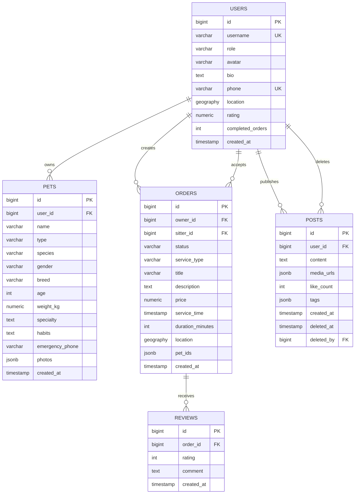
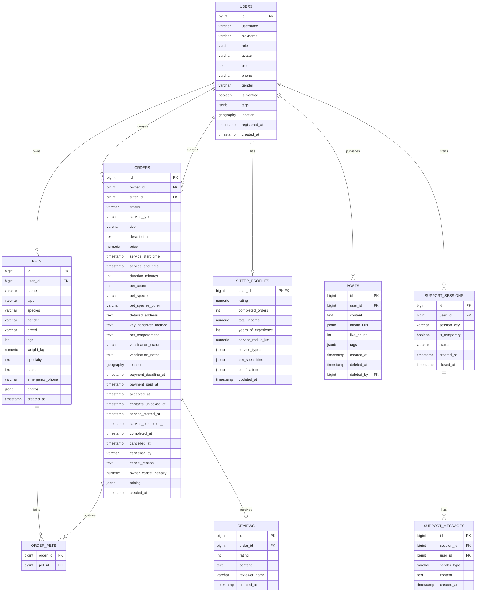

# 数据库 ER 结构说明文档

## 1. 文档目标

本文档说明宠友邻当前数据库结构、代码数据模型与目标 ER 结构之间的关系。当前项目默认仍以 Mock Store 演示为主，数据库 SQL 已提供基础骨架，但还未完全覆盖前端和后端的所有功能字段。

## 2. 信息来源

- `backend/sql/init_postgis.sql`
- `backend/app/models/entities.py`
- `backend/app/schemas/*.py`
- `backend/app/services/store.py`
- `backend/app/data/mock_data.py`
- `docker-compose.yml`

## 3. 当前数据库部署现状

项目已提供：

- PostgreSQL 16 + PostGIS
- Redis 7
- 初始化 SQL 自动挂载执行

当前业务说明：

- API 默认使用 `MockStore` 内存数据。
- PostgreSQL 当前主要用于基础设施验证和后续迁移准备。
- 宠物新增逻辑会尝试写入 PostgreSQL，验证局部持久化路径。
- Redis 容器已提供，但业务层尚未使用。

## 4. 当前 SQL 已定义对象

`backend/sql/init_postgis.sql` 已定义：

- `users`
- `pets`
- `orders`
- `posts`
- `reviews`
- `nearby_pending_orders` 视图

## 5. 当前 SQL ER 图

```mermaid
erDiagram
    USERS ||--o{ PETS : owns
    USERS ||--o{ ORDERS : creates
    USERS ||--o{ ORDERS : accepts
    USERS ||--o{ POSTS : publishes
    USERS ||--o{ POSTS : deletes
    ORDERS ||--o{ REVIEWS : receives

    USERS {
        bigint id PK
        varchar username UK
        varchar role
        varchar avatar
        text bio
        varchar phone UK
        geography location
        numeric rating
        int completed_orders
        timestamp created_at
    }

    PETS {
        bigint id PK
        bigint user_id FK
        varchar name
        varchar type
        varchar species
        varchar gender
        varchar breed
        int age
        numeric weight_kg
        text specialty
        text habits
        varchar emergency_phone
        jsonb photos
        timestamp created_at
    }

    ORDERS {
        bigint id PK
        bigint owner_id FK
        bigint sitter_id FK
        varchar status
        varchar service_type
        varchar title
        text description
        numeric price
        timestamp service_time
        int duration_minutes
        geography location
        jsonb pet_ids
        timestamp created_at
    }

    POSTS {
        bigint id PK
        bigint user_id FK
        text content
        jsonb media_urls
        int like_count
        jsonb tags
        timestamp created_at
        timestamp deleted_at
        bigint deleted_by FK
    }

    REVIEWS {
        bigint id PK
        bigint order_id FK
        int rating
        text comment
        timestamp created_at
    }
```

## 6. 当前表结构说明

### 6.1 users

用途：平台用户基础资料。

关键字段：

- `username`
- `role`：`owner` / `sitter`
- `avatar`
- `bio`
- `phone`
- `location`：PostGIS `GEOGRAPHY(POINT, 4326)`
- `rating`
- `completed_orders`

与代码模型差距：

- 代码中的 `UserProfile` 还有 `nickname`、`gender`、`registered_at`、`is_verified`、`tags`。
- 当前铲屎官个人中心、接单记录和任务大厅还有经验、可接类型、服务表现、收入等展示字段，这些尚未在 SQL 中建模。

### 6.2 pets

用途：宠物档案。

关键字段：

- `user_id`
- `name`
- `type`
- `species`
- `gender`
- `breed`
- `age`
- `weight_kg`
- `specialty`
- `habits`
- `emergency_phone`
- `photos`

当前已基本对齐前端新增宠物和宠物档案展示。

### 6.3 orders

用途：订单主表。

当前 SQL 字段：

- `owner_id`
- `sitter_id`
- `status`
- `service_type`
- `title`
- `description`
- `price`
- `service_time`
- `duration_minutes`
- `location`
- `pet_ids`
- `created_at`

与代码模型差距较大。后端 `OrderItem` 还包含：

- `service_start_time`
- `service_end_time`
- `pet_count`
- `pet_species`
- `pet_species_other`
- `detailed_address`
- `key_handover_method`
- `pet_temperament`
- `vaccination_status`
- `vaccination_notes`
- `distance_km`
- `payment_deadline_at`
- `payment_paid_at`
- `accepted_at`
- `contacts_unlocked_at`
- `service_started_at`
- `service_completed_at`
- `completed_at`
- `cancelled_at`
- `cancelled_by`
- `cancel_reason`
- `owner_cancel_penalty`
- `pricing`
- `review`

当前 SQL 的 `status` 仅允许 `pending`、`taken`、`done`、`cancelled`，而代码实际状态包括：

- `pending_payment`
- `pending`
- `pending_service`
- `in_service`
- `pending_confirmation`
- `completed`
- `appealing`
- `refunding`
- `cancelled`

因此如果要真实落库，`orders.status` 约束必须更新。

### 6.4 posts

用途：社区帖子。

字段已覆盖当前帖子主体：

- `user_id`
- `content`
- `media_urls`
- `like_count`
- `tags`
- `created_at`
- `deleted_at`
- `deleted_by`

当前代码在响应中拼接 `author` 对象，该对象应由 `posts.user_id -> users.id` 联查得到。

### 6.5 reviews

用途：订单评价。

当前字段：

- `order_id`
- `rating`
- `comment`
- `created_at`

与代码模型差距：

- 代码中的 `OrderReview` 使用 `content`、`reviewer_name`。
- 当前业务更接近“一单一评”，建议对 `order_id` 增加唯一约束。

## 7. 当前视图

### nearby_pending_orders

当前视图只筛选 `orders.status = 'pending'`，并没有计算距离。

真实附近任务查询建议使用：

- `ST_DWithin(location, user_location, radius)`
- `ST_Distance(location, user_location)`
- GIST 空间索引

## 8. 当前已存在索引

- `idx_users_location`：用户位置空间索引
- `idx_orders_status`：订单状态索引
- `idx_orders_location`：订单位置空间索引

## 9. 代码中已有但 SQL 未落表的实体

### 9.1 support_sessions

当前功能：

- 登录用户客服消息
- 未登录临时客服会话
- 每个会话多条消息

建议字段：

- `id`
- `session_key`
- `user_id`
- `is_temporary`
- `status`
- `created_at`
- `closed_at`

### 9.2 support_messages

建议字段：

- `id`
- `session_id`
- `user_id`
- `sender_type`：`user` / `support`
- `content`
- `created_at`

当前后端 `SupportMessage` 只有 `user_id`，临时会话用 `guest_session_id` 在内存中维护，正式数据库应以 `session_id` 为主关系。

### 9.3 order_pets

当前 `orders.pet_ids` 是 JSONB。正式结构建议拆中间表：

- `order_id`
- `pet_id`

好处：

- 真实外键
- 方便联查
- 方便统计
- 避免 JSONB 数组一致性问题

### 9.4 sitter_profiles

当前铲屎官侧已有以下概念：

- 服务评分
- 完成单量
- 累计收入
- 接单记录
- 身份资料
- 养宠经验
- 可接服务类型
- 最近评价

建议拆出 `sitter_profiles`：

- `user_id`
- `years_of_experience`
- `service_radius_km`
- `service_types`
- `pet_specialties`
- `certifications`
- `rating`
- `completed_orders`
- `total_income`
- `updated_at`

### 9.5 sitter_schedules / payout_records

铲屎官个人中心已有排期管理、收入明细入口。正式化时建议补：

- `sitter_schedules`
- `payout_records`
- `income_records`

## 10. 建议目标 ER 图

```mermaid
erDiagram
    USERS ||--o{ PETS : owns
    USERS ||--o{ ORDERS : creates
    USERS ||--o{ ORDERS : accepts
    USERS ||--o| SITTER_PROFILES : has
    USERS ||--o{ POSTS : publishes
    USERS ||--o{ SUPPORT_SESSIONS : starts

    ORDERS ||--o{ ORDER_PETS : contains
    PETS ||--o{ ORDER_PETS : joins
    ORDERS ||--o| REVIEWS : receives

    SUPPORT_SESSIONS ||--o{ SUPPORT_MESSAGES : has

    USERS {
        bigint id PK
        varchar username
        varchar nickname
        varchar role
        varchar avatar
        text bio
        varchar phone
        varchar gender
        boolean is_verified
        jsonb tags
        geography location
        timestamp registered_at
        timestamp created_at
    }

    SITTER_PROFILES {
        bigint user_id PK,FK
        numeric rating
        int completed_orders
        numeric total_income
        int years_of_experience
        numeric service_radius_km
        jsonb service_types
        jsonb pet_specialties
        jsonb certifications
        timestamp updated_at
    }

    PETS {
        bigint id PK
        bigint user_id FK
        varchar name
        varchar type
        varchar species
        varchar gender
        varchar breed
        int age
        numeric weight_kg
        text specialty
        text habits
        varchar emergency_phone
        jsonb photos
        timestamp created_at
    }

    ORDERS {
        bigint id PK
        bigint owner_id FK
        bigint sitter_id FK
        varchar status
        varchar service_type
        varchar title
        text description
        numeric price
        timestamp service_start_time
        timestamp service_end_time
        int duration_minutes
        int pet_count
        varchar pet_species
        varchar pet_species_other
        text detailed_address
        text key_handover_method
        text pet_temperament
        varchar vaccination_status
        text vaccination_notes
        geography location
        timestamp payment_deadline_at
        timestamp payment_paid_at
        timestamp accepted_at
        timestamp contacts_unlocked_at
        timestamp service_started_at
        timestamp service_completed_at
        timestamp completed_at
        timestamp cancelled_at
        varchar cancelled_by
        text cancel_reason
        numeric owner_cancel_penalty
        jsonb pricing
        timestamp created_at
    }

    ORDER_PETS {
        bigint order_id FK
        bigint pet_id FK
    }

    REVIEWS {
        bigint id PK
        bigint order_id FK
        int rating
        text content
        varchar reviewer_name
        timestamp created_at
    }

    POSTS {
        bigint id PK
        bigint user_id FK
        text content
        jsonb media_urls
        int like_count
        jsonb tags
        timestamp created_at
        timestamp deleted_at
        bigint deleted_by FK
    }

    SUPPORT_SESSIONS {
        bigint id PK
        bigint user_id FK
        varchar session_key
        boolean is_temporary
        varchar status
        timestamp created_at
        timestamp closed_at
    }

    SUPPORT_MESSAGES {
        bigint id PK
        bigint session_id FK
        bigint user_id FK
        varchar sender_type
        text content
        timestamp created_at
    }
```

## 11. 推荐主外键

- `pets.user_id -> users.id`
- `orders.owner_id -> users.id`
- `orders.sitter_id -> users.id`
- `posts.user_id -> users.id`
- `posts.deleted_by -> users.id`
- `reviews.order_id -> orders.id`
- `order_pets.order_id -> orders.id`
- `order_pets.pet_id -> pets.id`
- `sitter_profiles.user_id -> users.id`
- `support_sessions.user_id -> users.id`
- `support_messages.session_id -> support_sessions.id`
- `support_messages.user_id -> users.id`

## 12. 推荐索引

当前已有：

- `users(location)` GIST
- `orders(status)`
- `orders(location)` GIST

建议新增：

- `orders(owner_id, created_at desc)`
- `orders(sitter_id, created_at desc)`
- `orders(status, created_at desc)`
- `orders(service_start_time)`
- `posts(user_id, created_at desc)`
- `posts(deleted_at)`
- `reviews(order_id)` unique
- `order_pets(order_id, pet_id)` unique
- `support_sessions(user_id, created_at desc)`
- `support_sessions(session_key)` unique
- `support_messages(session_id, created_at asc)`

## 13. 数据库落地优先级

1. 扩展 `orders`，对齐当前订单状态和字段。
2. 新增 `order_pets`，替代 JSONB `pet_ids`。
3. 扩展 `users` 或新增 `sitter_profiles`，承接身份认证、服务能力、收入统计。
4. 新增 `support_sessions`、`support_messages`。
5. 补齐 `reviews` 字段和唯一约束。
6. 将附近任务查询迁移到 PostGIS。
7. 引入 Alembic 管理后续迁移。

## 14. 结论

当前数据库已经具备用户、宠物、订单、社区、评价的基础骨架，并且有 PostGIS 空间字段。但当前前端功能已经比 SQL 表更丰富，尤其是订单状态流转、接单记录、任务大厅、客服会话和铲屎官资料。正式接入数据库前，建议优先扩展订单表和客服表，再逐步替换 Mock Store。
